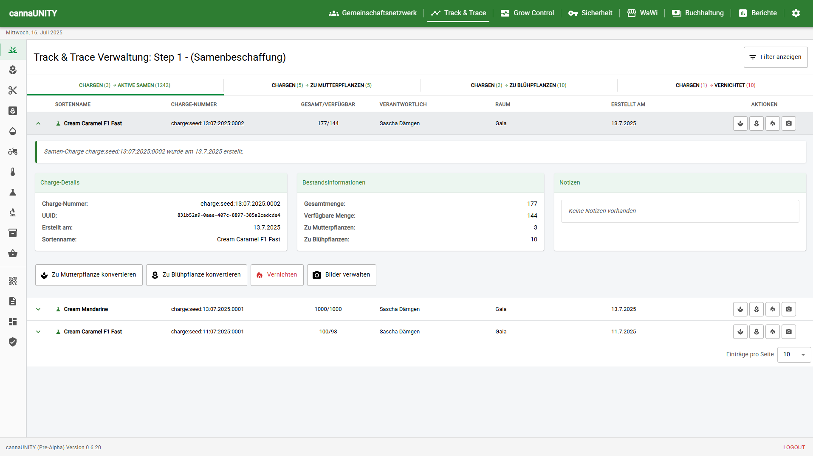

# 🌿 cannaUNITY v0.6.20 (Pre-Alpha)


<p align="center">
  
</p>

> **Modular Open-Source Software Framework for Cannabis Social Clubs and Cultivation Associations in accordance with the German Consumer Cannabis Act § (KCanG)**
> Member Management · eAssociation Management · Report Management · Task Planning · Grow Controller · Access Control · eTimecard · Track & Trace · Accounting · Inventory Management · Room Automation · Security System · iOS & Android APP · Administration, Admin and User UIs

(Master view for "fixed" UI Panel 1920x1080p)

<p align="center">
  
</p>

---

## 📦 What is cannaUNITY?

**cannaUNITY** is a professional open-source framework for organizing, managing, and automating cannabis cultivation associations in accordance with the Consumer Cannabis Act (KCanG).

> **Note:**  
> This repository contains the **framework** as a technical toolkit and is not intended as a ready-to-use complete system. For productive use, the framework must be integrated by developers into existing or new system landscapes.

---

## 🧩 Concept and Objectives

cannaUNITY provides all building blocks and interfaces to digitally, automatically, and transparently map the legal and organizational requirements of modern cannabis cultivation associations.  
Key points include:

- **Access Control** (UniFi Access, age/THC-appropriate)
- **AI-powered, GDPR-compliant Logging** (UniFi Protect)
- **Automated System Control** (SIMATIC S7 Integration)
- **Inventory Management and Accounting** (GoB-compliant, process-based)

> **ℹ️ Target Audience:**  
> - Developers and tech teams who want to set up customized or expandable solutions  
> - Integrators and service providers who technically support associations  
> - Associations with their own IT expertise

---

## 🚧 Current Status

- This repository represents the **open-source framework** and is primarily aimed at developers and technical teams.
- A paid **Professional Version** (ready-to-use complete solution, including configuration and installation packages) is in planning.
- Additionally, **matching hardware components** (rental or purchase as a package) will be offered in the future to enable a seamless end-to-end solution.

> **⚠️ Important:**  
> The framework alone is not intended as a plug-and-play solution!  
> Later productive use requires integration and possibly adaptation to the respective system environment.

---

## 💡 Highlights

- **Modular, modern, extensible framework**
- **Legal compliance** (transparency, traceability, data protection)
- **Automation** of all operational and documentation-required processes
- **Flexible hardware integration**
- **10-step UUID Track & Trace**
- **GoB-compliant accounting and inventory management**
- **Future-proof**: Roadmap to Professional Version with hardware bundles

---

## 📈 Roadmap

- [ ] Framework release as Open Source Final v1.xx
- [ ] Development of the Professional Version (ready-to-use complete solution)
- [ ] Expansion with official hardware offerings (rental/purchase)
- [ ] Support for additional interfaces and technologies

---

**cannaUNITY** stands for the highest level of transparency, security, and technical future-readiness in cannabis cultivation associations – today as a framework, tomorrow as a fully integrated complete solution.
"Crescit sub pondere virtus." – "Virtue grows under pressure."

---

## 🧪 Features

- ✅ Real-time UUID Track & Trace of plants, processing & product dispensing
- ✅ Generation of batch and lot numbers including 128-bit UUID integration
- ✅ Native Android, iOS & Windows APP
- ✅ Matrix 2.0 Protocol Integration + Element X Integration
- ✅ WordPress or Joomla CMS online connection via ZKP/SSH Tunnel
- ✅ Digitized product dispensing with limit control
- ✅ Encrypted member communication - end-to-end encrypted group chats
- ✅ RFID/NFC time tracking with mini-job/mandatory hours & volunteer recognition
- ✅ Automatic AI person recognition via UniFi Protect AI Key API / Webhook integration
- ✅ Dynamic member profiles with UUID RFID cards including Evolis card printer integration
- ✅ SIMATIC S7 1200 G2 integration with API-controlled light, climate, and process automation
- ✅ Fully redundant room controls with central UI connection & alarm server
- ✅ Native API support for UniFi (Ubiquiti) Access, Protect, AI Key and Network
- ✅ Room automation (Loxone, Honeywell)
- ✅ Grow controller with integration for WYSIWYG room designer
- ✅ Laboratory report management including HPLC & GC (CSV import)
- ✅ Complete logging for authority access
- ✅ Touch panel control & custom UI panels for room display
- ✅ Anonymized product dispensing with UUID linking via ZKP (online)
- ✅ Inventory management system (WaWi) with Track & Trace / Accounting integration  
- ✅ Create, manage & store GMP-compliant laboratory reports
- ✅ GoB-compliant accounting with complete journal display
- ✅ Reversal bookings with counter-booking unwinding (DEBIT/CREDIT)
- ✅ Single and multiple bookings including sub-transactions & account selection
- ✅ Complete linking to member accounts & membership fees
- ✅ Filterable journal view by year, month, type & reversal status
- ✅ Multi-Chain ForeignKey Track&Trace: Seamless traceability of all products ("Chain-of-Custody") via ForeignKey

---

<p align="center">
  
</p>

---

## 🧠 Architecture Overview

- **Backend:** Django 5.x (API-only), Django REST Framework, PostgreSQL (P) / SQLite (E)
- **Frontend:** React + Vite + Material UI (SPA)
- **Data Model:** Multi-Chain ForeignKey linking of all Track&Trace objects (from packaging unit to original seed or mother plant), with dynamic UI filtering and guaranteed consistent provenance chain. Unique flexibility, maximum traceability.
- **Interfaces:** UniFi Access/Protect (native), WordPress, Joomla, Siemens SIMATIC S7 1200 G2, Loxone Mini Server, Agilent 1260 Infinity HPLC, TSC TC200, Evolis Primacy, MQTTS, REST
- **Technologies:** TokenAuth, Matrix 2.0, WebSocket, Axios, passkey-auth, container-compatible

```
flowchart LR
    PU[Packaging Unit] --> PVB[Processing Batches]
    PVB --> DRY[Drying]
    DRY --> HRV[Harvest]
    HRV --> BLF[Flowering Plant]
    BLF --> SEED[SeedPurchase/Mother Plant]
    SEED --> STR[Genetics / Strain]
```

---

<p align="center">
  
</p>

---

## 🛡️ § KCanG Compliant, Data Protection & Anonymization Concept

**cannaUNITY** is completely based on the zero-knowledge principle:  
There is a strict separation between personal data (local) and anonymized online data (UUID-based). The online area **never** receives access to real identities or personal data!

### Authentication & Access Control

```
[Local: Root Server]                              [Online Server]
 ┌──────────────────────────┐                     ┌────────────────────────────┐
 │ Django Backend           │                     │ Sync Database/API          │
 │ Local PostgreSQL DB      │                     │ Login/API for Mobile App   │
 │ Internal UI (Admin, Web) │                     │                            │
 └────────────┬─────────────┘                     └────────────┬──────────────┘
              │    🔄 Pull/Push via API                  🔄 Pull by App
              ▼                                           ▼
     → One-way Communication:                   [React Native App (e.g., iOS)]
     Local Cronjob sends Data →                Access **only to Online API**

Optional > Push Gateway: Local Server → Mini-API on VPS → pushes data to App API
```

- **Online Login:** Joomla/Passkey (biometric), alternatively 3-factor with PIN  
- **Facility Access (Outdoor Areas):** UniFi Access with RFID, facial recognition, optional PIN  
- **Interior Areas (e.g., Flowering Chamber):** Access exclusively via NFC/RFID, automatic time tracking  
- **Production Steps:** Track&Trace entries are made via RFID/NFC terminals with role binding

---

## 🔁 UUID Track & Trace: From Seed to Dispensing incl. MMS

<p align="center">
  
</p>

Every processing step is documented and tamper-proof logged:

1. **Purchase** of seed
2. **Planting** – either as mother plant or directly as flowering plant
3. **Cutting Treatment**
4. **Growth Care**
5. **Harvest**
6. **Drying**
7. **Laboratory Control**
8. **Processing**
9. **Product Dispensing** to members (anonymized)
10. **Destruction** (optional, if necessary)

Each step is confirmed via employee accounts using RFID/NFC and documented in real-time.

- 🚦 **Unique to cannaUNITY:**  
> Thanks to Multi-Chain ForeignKey architecture, all processing paths (seeds, cuttings, mixed cultures) are completely seamlessly mapped – from packaging unit to the origin of genetics.  
> Every processing chain remains traceable even after migration, renaming, or adjustment and always references the real objects – no redundancies, no "shadow fields," no data loss.

<p align="center">
  
</p>

Multimedia Support in Track&Trace Module

The Track & Trace system now supports upload and assignment of multimedia files (images and videos) to the respective work steps of individual batches. The implementation is currently productively enabled for steps 1 to 5:

✅ Step 1: Seed Purchase (SeedPurchase)
✅ Step 2: Mother Plants (MotherPlantBatch)
✅ Step 3: Flowering Plants from Seeds (FloweringPlantBatch)
✅ Step 4: Cuttings (CuttingBatch)
✅ Step 5: Flowering Plants from Cuttings (BloomingCuttingBatch)
✅ Step 6: Harvest
✅ Step 7: Drying
✅ Step 8: Processing
✅ Step 9: Laboratory Control
✅ Step 10: Packaging
✅ Step 11: Product Dispensing

✅ Additionally: Multimedia Management, Cannabis Rating & Destruction.

Files are securely stored on the backend and are only accessible within the closed association network. Additionally, server-side hooks have been prepared to optionally automatically share content in verified, private Facebook groups consisting exclusively of previously approved association members.

---

## 🔧 UniFi Protect Sensors – Automated Room Climate Monitoring for Cannabis Track & Trace

<p align="center">
  
</p>

Our platform now supports the latest generation of UniFi Protect Sensors (UP-Sense), fully integrated and future-proof thanks to SuperLink architecture. This makes us the first software solution to offer seamless, GMP-compliant monitoring of temperature, humidity, light, and more – directly in all sensitive production areas.

## What makes this feature so unique?

✅ Native connection to UniFi Protect 6.0 with AI-powered monitoring
✅ Real-time status and seamless historization of all sensor values for EU-GMP/BfArM compliance & audits
✅ SuperLink-Ready: Already prepared for upcoming long-range sensors (2km range) – no code changes needed when upgrading
✅ Multi-sensor monitoring with intelligent alarm and conflict management
✅ Automatic data export and PDF reports for authority inspections
✅ Touch-optimized frontend with live status, signal strength, quick ranges & powerful charts

## Typical Application Areas:

✅ Precise climate control in flowering chambers, drying rooms, and storage areas
✅ Explosion protection monitoring in extraction laboratory
✅ Tamper-proof storage of all values for maximum traceability

With this integration, you're relying on industry standards and maximum scalability: Whether small rooms via Bluetooth or entire warehouses via SuperLink in the future – our system is ready!

## 🔧 Integration & Automation

<p align="center">
  
</p>

cannaUNITY now fully relies on the latest generation of Siemens SIMATIC S7-1200 G2 control technology. The previously integrated Siemens LOGO8! connection was removed due to its conceptual limitations. The LOGO series offered no structured API, no remotely configurable time switching logic, and was neither scalable nor maintainable for multi-room grow controller operation.

The SIMATIC G2, on the other hand, enables for the first time complete control of industrial processes via a modern web architecture with genuine API communication – secure, performant, redundant, and fully integrable into the cannaUNITY frontend.

🔌 Highlights of SIMATIC G2 Integration
✅ Web API with structured REST communication (HTTPS, JSON)
✅ MQTT connection with topic flexibility via LMQTT_FB
✅ Matrix 2.0 & TLS encryption, multi-session, authentication
✅ Time switching, ramp, and scene control configurable via Django
✅ UUID-based linking of each PLC to a room object
✅ Redundant autonomous operation: Rooms function even without central server
✅ Immutable audit trails - blockchain-like event chains for authority compliance

🌞 0-10V Light Control & Daylight Profiles
Via the SM1232-AQ analog output module, cannaUNITY controls all 0-10V LED grow lights energy-efficiently and dynamically – directly from the central UI. The light profiles include sunrise and sunset simulations with finely graduated dimming down to exactly 0%, which many other systems technically do not support.

Light, pH, EC, climate, and ventilation control is done via user-friendly time grids with ramp functions, configured in the cannaUNITY interface and transmitted to the PLC via API. Each room operates independently and has its own PLC – fully synchronized but autonomously functional.

With this architecture, cannaUNITY brings industrial PLC technology for the first time into a visually controllable web environment for growers – without PLC knowledge, without STEP7, without classic programming. Control is entirely via an interactive UI that captures and addresses not only light but also climate, irrigation, drying, and process cycles in real-time.

---

## 📘 Accounting System: GoB-Compliant, Modular Financial Overview

<p align="center">
  
</p>

The integrated accounting system is fully GoB-compliant and allows transparent, structured representation of all financial transactions in the association.
It was specifically developed for cultivation associations and combines classic accounting principles with modern, filterable display in the web interface.

Supported Functions & Modules:
1. General Ledger – T-account overview with DEBIT/CREDIT balances and journal display
2. Profit and Loss Statement (P&L) – grouped display by cost types
3. Balance Sheet – Date-specific balance sheet with balance equation verification
4. Member Linking – automatic connection of bookings to membership fees
5. Reversal Logic – retroactive reversal with counter-booking & filter options
6. Multiple Bookings – sub-transactions with continuous booking numbering
7. Filter Functions – by year, month, booking type, reversal status, and purpose
8. Interface Preparation – DATEV, CSV, PDF export planned
9. Future-Proof – support for annual closing, EÜR/switching, balance transfer
10. Inventory Management System with Track and Trace + Accounting integration

Each booking is stored in an audit-proof manner, made fully visible through the journal, and can be evaluated in real-time.
The implementation follows the principles of proper bookkeeping (GoB) and forms the basis for tax-relevant evaluations.

---

## 🌿 Inventory Management System: Integrated Cannabis Genetics Management with Track & Trace

<p align="center">
  
</p>

The inventory management system forms the heart of cannabis management and seamlessly connects genetics master data with operational inventory management.
Through bidirectional integration with Track & Trace and Accounting, a closed loop is created from seed purchase to harvest.
Supported Functions & Modules:

1. Genetics Database – Over 40 attributes per strain (THC/CBD, terpenes, growth)
2. Price Tier System – Flexible volume discounts with automatic calculation
3. Track & Trace Integration – Live inventory display from operational data
4. Accounting Workflow – Purchase request → Approval → Booking
5. RFID Authorization via UniFi Access – Tamper-proof documentation of all actions
6. Media Management – Multi-image support with metadata & drag & drop
7. Purchase Aggregation – Cross-batch inventory determination
8. Immutable Audit Trails – Seamless change history for compliance
9. API Interfaces – REST-based communication between systems
10. Real-Time Metrics – Available seeds, plant conversions, losses

```
Track&Trace DB → Django ORM → API Endpoint → React Component → UI Update
     ↑                                              ↓
     └──────────── User Actions ←───────────────────┘
```

Each order automatically goes through the accounting approval process, is recorded in Track & Trace as goods receipt, and immediately updates the inventory overview in the inventory management system.
The solution meets all regulatory requirements of the Consumer Cannabis Act (KCanG) and enables audit-proof documentation of the entire supply chain.

---

## 🐳 Deployment & Infrastructure

Planned:

- Own **Docker images** with standard configuration
- **Proxmox-compatible images** for easy VM integration
- Own **Linux distribution (cannaOS)** for specially configured mini PCs
- (Paid) Pre-configured end-customer solutions
- (Paid) Complete hardware sets for purchase/rental

---

## 📂 Project Structure (Excerpt)

```
cannaUNITY/
├── backend/
│   ├── config/            # Django settings
│   ├── members/           # Member management
│   ├── rooms/             # Rooms & sensors
│   └── static/frontend/   # React app build
├── frontend/
│   ├── src/
│   │   ├── apps/          # React apps per Django module
│   │   ├── layout/        # Topbar, Sidebar, Footer
│   │   └── main.jsx
```

---

## 🔐 Authentication Concept

### 🏗️ Zero-Knowledge Architecture
- **Airgapped PostgreSQL**: Row-Level-Security (RLS) with pgcrypto Extension, AES-256-GCM for sensitive columns
- **Anonymous Cloud Layer**: MariaDB with encrypted UIDs (HMAC-SHA3-512), Zero-PII Storage Policy
- **Unidirectional Replication**: SSH Tunnel (Ed25519) with Read-Only pg_read_all_data Role, Write via REST with mTLS
- **Network Segregation**: DMZ architecture with Jump-Host, iptables Egress-Only Rules for local network

### 🛡️ Multi-Factor Authentication (3FA)
📱 Device Certificate (X.509) + 🤳 Biometrics + 🔢 PIN = ✅ Access

- **Possession Factor**: Device fingerprinting via X.509 Client Certs + Hardware Attestation (iOS: DeviceCheck API, Android: SafetyNet/Play Integrity)
- **Inherence Factor**: Biometric templates in Secure Enclave (iOS) / Trusted Execution Environment (Android), FIDO2/WebAuthn Level 2 compliant
- **Knowledge Factor**: Argon2id hashed PIN (m=64MB, t=3, p=4), timing-attack resistant implementation
- **Zero-Password Architecture**: Complete elimination of traditional passwords, NIST 800-63B compliant

### 🎯 Token Hierarchy & Cryptography
| Token Type | 🔐 Crypto | ⏱️ TTL | 🎯 Purpose |
|------------|-----------|--------|------------|
| **QR-Code** | RSA-4096 OAEP | 5 min | Initial Device Registration |
| **Device** | Ed25519 + ECDHE | 180 days | Long-term Authentication |
| **Session** | JWT ES384 | 24 hours | API Access Token |

- **Storage Layer**: Expo SecureStore (iOS: Keychain kSecAttrAccessibleWhenUnlockedThisDeviceOnly, Android: AES-256 via Android Keystore)

### 🚪 Physical Access & IoT Integration
- **UniFi Access API v2**: OAuth2 Device Flow, webhook-based real-time synchronization
- **NFC/RFID**: MIFARE DESFire EV3 with AES-128 Mutual Authentication, UID-based assignment
- **BLE Beacon Access**: iBeacon/Eddystone with Rolling Proximity UUIDs, RSSI-based distance verification
- **Audit Logging**: PostgreSQL Event Triggers → Kafka → Elasticsearch, WORM storage for compliance

### 🔒 Security Hardening & Compliance
- **Matrix Protocol Security**: E2EE via Olm/Megolm, Double Ratchet Algorithm, Ed25519 Signatures, Cross-Signing for Device Verification, Immutable Event DAG
- **TLS Configuration**: TLS 1.3 only, HSTS with Preloading, Certificate Transparency Monitoring
- **API Security**: OAuth 2.1 (draft-ietf-oauth-v2-1-09), PKCE mandatory, DPoP for Token Binding
- **Rate Limiting**: Token Bucket Algorithm (nginx-limit-req), distributed with Redis, adaptive thresholds
- **Geo-Restrictions**: MaxMind GeoIP2 with Precision City, Haversine Distance Calculation, configurable radius
- **GDPR**: Privacy by Design (Art. 25), Pseudonymization (Art. 4), Right to Erasure via Crypto-Shredding
- **Penetration Testing**: OWASP MASVS Level 2 compliant, regular security audits with Metasploit/Burp Suite

cannaUNITY revolutionizes cannabis association management through integration of the Matrix protocol. With Synapse as server backend and Element X as client, a future-proof infrastructure for Track & Trace and member communication is created.

Note:
This integration is under active development and sets new standards for data protection and tamper-proofing in the cannabis industry.

---

## 🚀 Modules (Excerpt)

| Module           | Description                                                                 |
|------------------|-----------------------------------------------------------------------------|
| `members`        | Members, limits, mandatory hours, status management                         |
| `trackandtrace`  | Processing steps (Seed → Bloom → Dispensing) incl. destructions             |
| `access`         | UniFi Access: RFID, FaceID, logs, access rights                             |
| `rooms`          | Room management with climate, sensors & automation                          |
| `taskmanager`    | Task reservation, hour account, reconciliations                             |
| `buchhaltung`    | GoB-compliant accounting with HBCI reconciliation                           |
| `interface`      | Touch panels, room terminals, info displays                                 |
| `controller`     | Siemens/Loxone integration                                                  |
| `security`       | Alarm systems, emergency access, authority access                           |

---

## 🧱 Production Operation – Security Concept

This section describes recommended measures for securing the cannaUNITY system when deployed on a public server or in a productive environment.

### 🔒 1. Security at Root Server & Operating System Level (Linux)

**System Hardening**
- SSH access exclusively with public key
- Disable root login
- Firewall (e.g., `ufw`) with whitelist for web & SSH
- Fail2Ban for brute-force attack protection

**Reverse Proxy**
- Use **NGINX** or **Traefik** in front of Django/React
- HTTPS via **Let's Encrypt / Certbot**
- Define CORS, HSTS, CSP headers

**Automatic Updates / Patch Management**
- `unattended-upgrades` or centralized Ansible scripts
- Monitor for known CVEs in dependencies

**Deployment & User Isolation**
- Separation of system users for services (e.g., `cannaunity-web`, `cannaunity-db`)
- Use `systemd` services with `PrivateTmp`, `ProtectSystem=strict`

### ⚙️ 2. Django: Security & API Protection

- `DEBUG = False` and `ALLOWED_HOSTS` correctly set
- `SECRET_KEY` securely stored (e.g., in `.env` or Vault)
- Use **HTTPOnly & Secure Cookies** for authentication tokens
- Enable **CSRF protection**, especially for API POST endpoints
- `SECURE_BROWSER_XSS_FILTER = True`, `SECURE_CONTENT_TYPE_NOSNIFF = True`
- **Logging & Audit Logs** for API access (e.g., with `django-auditlog`)

### 🎨 3. React/Vite: Frontend Security

- No access to `.env` variables with sensitive content in frontend
- Create build version with `vite build`, hashes active
- Check public folder for unwanted files
- Protection against XSS via controlled components & avoid `dangerouslySetInnerHTML`
- Enforce CSP headers via NGINX

### 🧊 4. Database Security (PostgreSQL + Encryption)

- **Disk encryption** at operating system level (`LUKS`, `dm-crypt`)
- **Enable SSL/TLS** in PostgreSQL (`ssl = on`, set up certificates)
- **Role-based access control** (no public access, least privilege)
- Use `pgcrypto` for column-based encryption of sensitive fields:

  ```sql
  SELECT pgp_sym_encrypt('0123 456789', 'my_secret_key');
  ```

- **Key Management** via HashiCorp Vault, Azure Key Vault, or custom solution
- Access logging & audit tools like [`pgAudit`](https://www.pgaudit.org/)

### 💡 Additional Recommendations

- **Backups** regular & encrypted (e.g., `borg`, `restic`)
- **Monitoring & Alerting** (e.g., UptimeRobot, Netdata, Prometheus/Grafana)
- **Zero-Trust Network Principle** (VPN, IP whitelisting, no open network)
- **Security review of all Django endpoints** before deployment

> Note: These recommendations are intentionally tailored to a productive setup on a dedicated root server. For cloud deployments (AWS, Azure, etc.), different best practices apply – including VPC isolation and IAM control structures.

---

## 📃 License & Usage Notes

cannaUNITY is a free open-source project under the MIT License.
The current version v0.6.20-pa is intended exclusively for co-development and system integration. The software is provided without warranty. Use is at your own risk. Liability for damages or data loss is excluded.

Copyright (c) 2025 Sascha Dämgen IT and More ✨
INT Fork Version by cannatoshi
